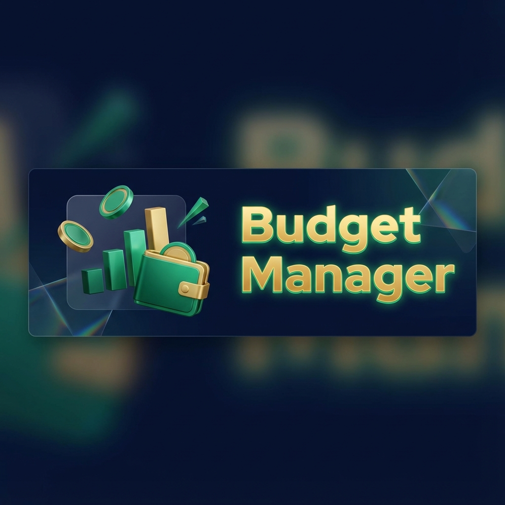
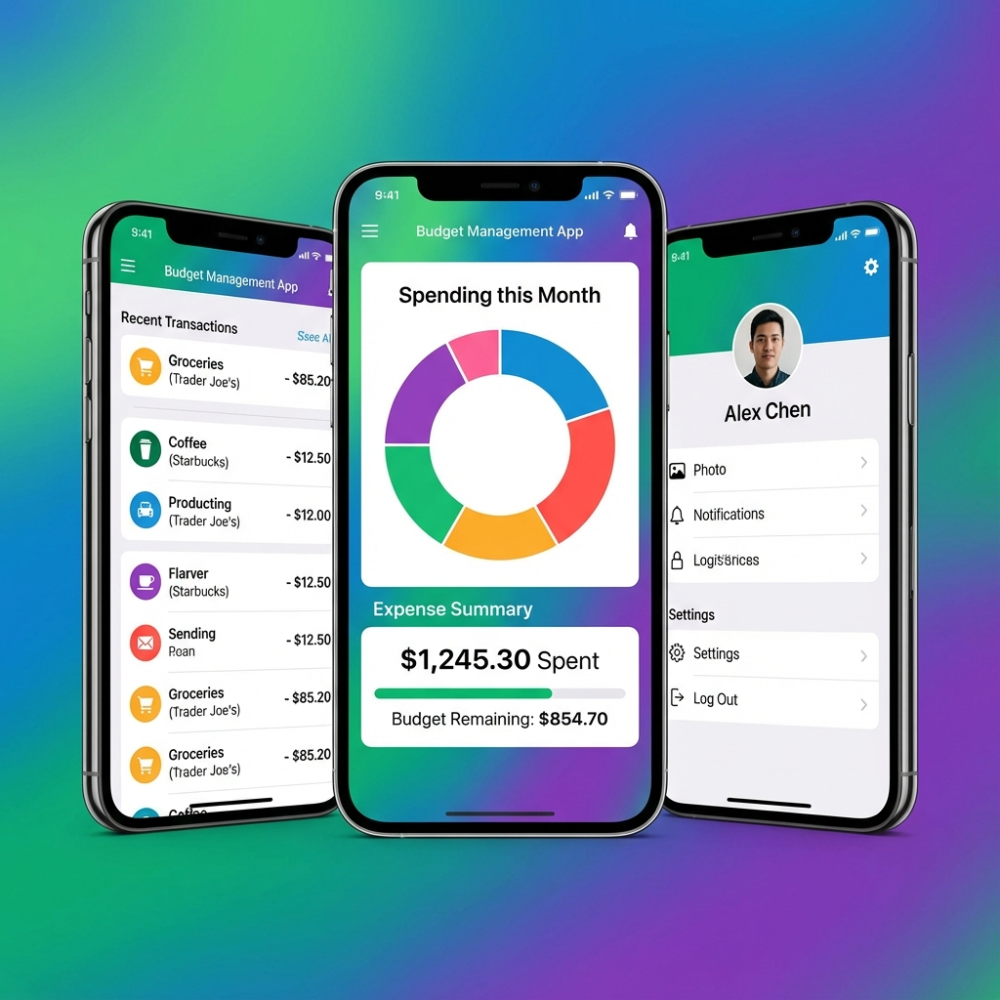

<div align="center">

# Budget Manager App


**Personal Finance Mastered.** Track expenses, visualize budgets, and take control of your financial health with a modern, intuitive Android experience.

[Report Bug](https://github.com/USERNAME/Budget-Management-App/issues) · [Request Feature](https://github.com/USERNAME/Budget-Management-App/issues)

</div>

---

## 📱 App Showcase



> **Note**: *The images shown above are conceptual mockups generated for demonstration purposes and may slightly differ from the actual application interface.*

## ✨ Key Features

| Feature | Description |
| :--- | :--- |
| **📊 Smart Visualizations** | Interactive charts powered by `MPAndroidChart` give you instant insights into spending habits. |
| **💰 Expense Tracking** | Log specific transactions with categories, dates, and amounts in seconds. |
| **🎨 Modern UI** | Clean, responsive Material Design interface with smooth animations. |
| **📂 Media Attachments** | Attach receipts or photos to transactions, optimized by `Glide`. |
| **🔒 Secure Local Storage** | Your financial data stays private on your device. |

## 🛠️ Technology Stack

Built with modern Android development best practices:

-   **Language**: [Kotlin](https://kotlinlang.org/)
-   **Architecture**: MVVM (Model-View-ViewModel)
-   **UI Components**: XML Layouts, ViewBinding, Material Components
-   **Dependencies**:
    -   `MPAndroidChart`: For beautiful data visualization.
    -   `Glide`: For efficient image loading and caching.
    -   `androidx.lifecycle`: For robust lifecycle management.

## 🚀 Getting Started

To view or work on this project locally:

1.  **Clone the repository**:
    ```bash
    git clone https://github.com/<YOUR_USERNAME>/Budget-Management-App.git
    ```
2.  **Open in Android Studio**:
    -   File > Open > Select the project folder.
3.  **Sync Gradle**:
    -   Allow Android Studio to download dependencies.
4.  **Run**:
    -   Connect a device or launch an emulator.
    -   Click the **Run** button (▶️).

## 🤝 Contributing

Contributions make the open-source community an amazing place to learn, inspire, and create. Any contributions you make are **greatly appreciated**.

See [CONTRIBUTING.md](CONTRIBUTING.md) for detailed guidelines.

## 📄 License

Distributed under the MIT License. See `LICENSE` for more information.

---
<div align="center">
    <i>Built with ❤️ by <a href="https://github.com/DT-R2001">DT-R2001</a></i>
</div>
